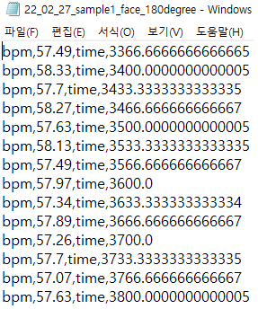

# ACIN [두근두근 심박수] 프로젝트 - 오차율 계산
### 본 프로그램은 ACIN 두근두근 심박수 프로젝트의 실험 위해 제작되었습니다.

1. 발견
    * 비접촉식 심박수 측정의 오차율이 있다는 것을 발견하였다.
    * 이를 실생활에서 신뢰도가 높은 bpm 측정기와 비교해 오차율을 계산하고 그의 패턴을 통해 비접촉식 심박수 오차를 줄이고자한다.
    * 본 프로그램은 형식이 다른 여러 결과 데이터를 기준이 되는 1개의 형식으로 변환하고 비교하며, 추가로 관리를 목적으로 한다.
    * 파일명 작성 방법: 년_월_일_이름_face or _ocr face는 비접촉식 측정기용 영상이며 _ocr은 접촉식 측정기용 영상이다.
2. 설명
    * 본 프로젝트에서 사용하는 비접촉식 심박수 측정 모듈을 다음과 같다.
        1. python 기반 Heart-rate-measurement-using-camera 
        2. c++ 기반 Heartbeat: Measuring heart rate using remote photoplethysmography (rPPG) 
    1. 오프라인 접촉식 측정기 [[ACIN-heart_rate_OCR](https://github.com/Grayson1999/ACIN-heart_rate_OCR)]
        1. 접촉식 측정기를 기준으로 오차율을 계산한다.
        2. 오프라인에서 측정되므로 데이터 변환이 필요하다.
        3. 이는 시간과 측정기를 같은 영상에 촬영하고 OCR을 통해 데이터를 가져오는 방법을 이용하여 데이터를 디지털화 하였다.
        * 결과 데이터
            1. 녹화 영상을 통해 시간에 따른 결과 데이터를 받아온다. 
            2. [OCR]DataSet_i.csv 파일로 저장된다.(단,i는 1부터 1씩 증가)
            

    2. Heart-rate(python) [[Heart-rate-measurement-using-camera](https://github.com/habom2310/Heart-rate-measurement-using-camera)]
        - 본 모듈은 결과데이터가 별도로 출력되지 않아 영상의 소요시간을 기준으로 데이터를 출력하였습니다.
        - 위 모듈의 데이터 형식은 각 동영상 시간에 따른 밀리세컨드(ms) 형식을 가진다. 이를 각각의 시각과 bpm으로 재표현하고, 이를 0.5초 간격으로 평균을 낸다.
            - 시각으로 변경하는 이유는 녹화 당시의 시간을 따로 맞추어 줄 필요 없이 시각 데이터로 원하는 부분을 판별 할 수 있기 때문이다.
        - ※ 본 모듈 사용 시 서버 시간이 같이 녹화 되어야 함
        - ※ 본 모듈의 결과 값을 출력하는 알고리즘을 수정하였으므로, 기본 결과 값은 다름
        1. 동영상 0.0ms의 캡쳐본을 통해 영상의 처음 서버시간을 입력 받는다.(구현 중)
        2. 입력 받은 서버 시간을 기준으로 수행시간을 더해 본 프로젝트에서 필요한 시각, bpm 데이터를 얻는다.
        * 원본 데이터 
            * [동영상 이름].txt 파일로 bpm과 time데이터가 ","를 기준으로 구분된다. 이때 time은 영상의 진행시간(소요시간)을 ms로 환산한 것을 의미한다.
            

        * 결과 데이터
            * [python]DataSet_i.csv 파일 변경된다.(단,i는 1부터 1씩 증가)
            * 시간은 동영상의 첫 장의 시간을 기준으로 하며 기존의 소요시간(ms)을 더하여 시간 형식으로 데이터를 변경한다.
            

